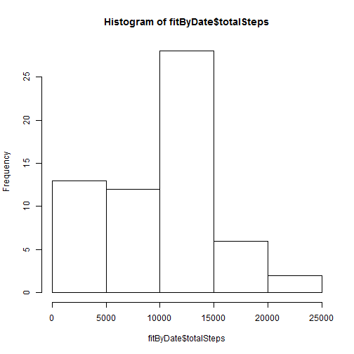
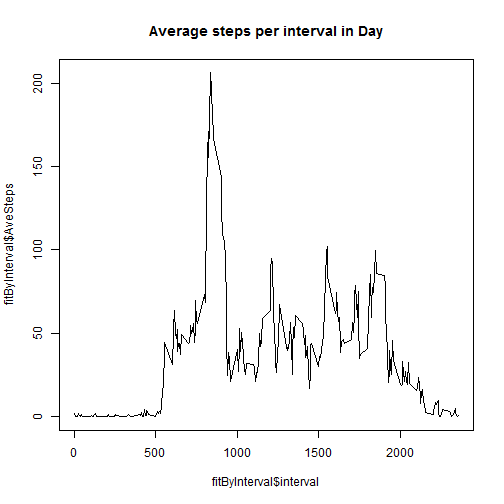
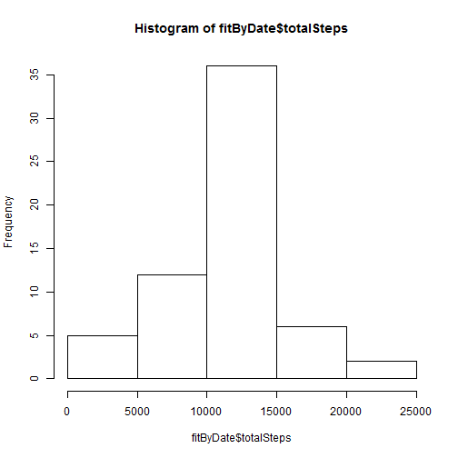
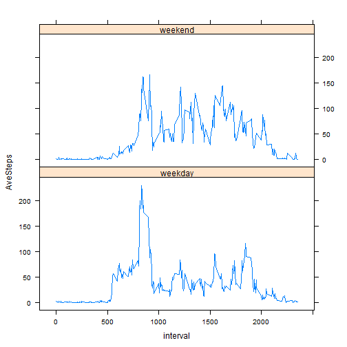

# Reproducable Research Assignment 1
Eric Riehl
April 3, 2016

## Loading and preprocessing the data

```r
library(dplyr)
fitdata <- read.csv("activity.csv", 
              header=TRUE, 
              colClasses=c("integer","Date","integer"), 
              na.strings = "NA")
```

## What is mean total number of steps taken per day?


```r
fitByDate <- group_by(fitdata,date) %>% summarize(totalSteps=sum(steps,na.rm=TRUE))
hist(fitByDate$totalSteps)
```



```r
meanPerDay <- mean (fitByDate$totalSteps)
medianPerDay <- median (fitByDate$totalSteps)
paste ("Mean steps per day is: ", toString(meanPerDay))
```

```
## [1] "Mean steps per day is:  9354.22950819672"
```

```r
paste ("Median steps per day is: ", toString(medianPerDay))
```

```
## [1] "Median steps per day is:  10395"
```


## What is the average daily activity pattern?


```r
fitByInterval <- group_by(fitdata,interval) %>% summarize(AveSteps=mean(steps, na.rm=TRUE))

plot(y=fitByInterval$AveSteps,x=fitByInterval$interval,type="l", main="Average steps per interval in Day")
```



```r
maxSteps <- max(fitByInterval$AveSteps)
maxIntervalIndex <- fitByInterval$AveSteps == maxSteps;
maxInterval <- fitByInterval[maxIntervalIndex,]$interval
paste("The interval with the most average steps is: ", toString(maxInterval))
```

```
## [1] "The interval with the most average steps is:  835"
```

## Imputing missing values

### the value for TRUE in the table is the total missing values

```r
table(is.na(fitdata$steps))
```

```
## 
## FALSE  TRUE 
## 15264  2304
```


```r
y<-merge (x=fitdata,y=fitByInterval,by="interval")
replaceIndex <- (is.na(y$steps))
fmissing <- y[replaceIndex,]
fmissing$steps <- fmissing$AveSteps
f2 <- y[!replaceIndex,]
newfitdata <- rbind(fmissing,f2)
newfitdata <- transmute(newfitdata,steps=steps,date=date,interval=interval) %>% arrange(date,interval)
```


```r
fitByDate <- group_by(newfitdata,date) %>% summarize(totalSteps=sum(steps,na.rm=TRUE))
hist(fitByDate$totalSteps)
```



```r
meanPerDay <- mean (fitByDate$totalSteps)
medianPerDay <- median (fitByDate$totalSteps)
paste ("Mean steps per day is: ", toString(meanPerDay))
```

```
## [1] "Mean steps per day is:  10766.1886792453"
```

```r
paste ("Median steps per day is: ", toString(medianPerDay))
```

```
## [1] "Median steps per day is:  10766.1886792453"
```
## Are there differences in activity patterns between weekdays and weekends?


```r
library(lattice)
newfitdata$daytype <- ifelse (weekdays(newfitdata$date) %in% c("Saturday","Sunday"),"weekend","weekday")
fitByInterval <- group_by(newfitdata,interval,daytype) %>% summarize(AveSteps=mean(steps, na.rm=TRUE))
xyplot(data = fitByInterval,AveSteps~interval|daytype,layout=c(1,2),type="l")
```


